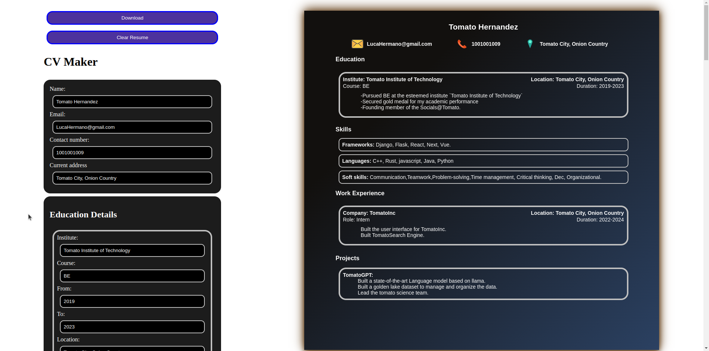

# CV Resume Builder

CV Resume Builder is a web application that simplifies the process of creating and downloading professional resumes and CVs. It provides an intuitive interface for users to input their personal information, education details, work experience, skills, and projects, and then generates a downloadable PDF resume.



## Features

- **Personal Details**: Enter your name, email, phone number, and current address to start building your resume.

- **Education Details**: Add your educational background, including the institute's name, course, start year, end year, and location.

- **Work Experience**: Record your work history by specifying your previous companies, roles, start and end dates, and job descriptions.

- **Skills and Projects**: Highlight your skills and projects with ease. Include skill types or project names along with detailed descriptions.

- **Download Your Resume**: Download your resume in PDF format with a single click.

## Technical Details

CV Resume Builder is built using modern web development technologies:

- **Frontend**: The frontend of the application is developed using [React](https://reactjs.org/), a popular JavaScript library for building user interfaces. It offers a responsive and interactive user experience.

- **PDF Generation**: To generate PDF files from the HTML content, the application utilizes [HTML2Canvas](https://html2canvas.hertzen.com/) to capture the HTML layout as a canvas and [jsPDF](https://github.com/MrRio/jsPDF) to create downloadable PDFs.

- **Data Persistence**: User data such as personal information, education details, work experience, skills, and projects are stored locally using [localStorage](https://developer.mozilla.org/en-US/docs/Web/API/Window/localStorage).

## Implementation Approach

The application is divided into several components:

- `PersonalDetailsForm`: Collects personal information like name, email, phone, and address.

- `ExperienceDetails`: Manages education and work experience details, allowing users to add, edit, and delete entries.

- `SkillOrProject`: Handles skills and project information, enabling users to add, edit, and delete entries.

- `DisplayPersonalDetails`, `DisplayExperienceDetails`, and `DisplaySkillOrProject`: Display user-entered data in a preview section.

The PDF generation process involves using `html2canvas` to capture the content of the preview section and then creating a PDF using `jsPDF`.

## Getting Started

To run the CV Resume Builder on your local machine:

1. **Install Dependencies**:

   Navigate to the project directory and install the required dependencies using:

   ```shell
   npm install
   ```

2. **Run the Application**:

   ```shell
   npm run dev
   ```

## Usage

1. **Fill in Your Details**: Start by entering your personal information in the "Personal Details" section.

2. **Education Details**: Add your educational background by clicking on the "Add Education" button.

3. **Work Experience**: Record your work history by clicking on the "Add Work Experience" button.

4. **Skills and Projects**: Highlight your skills and projects using the respective sections.

5. **Download Your Resume**: Click the "Download" button to save your resume as a PDF file.
